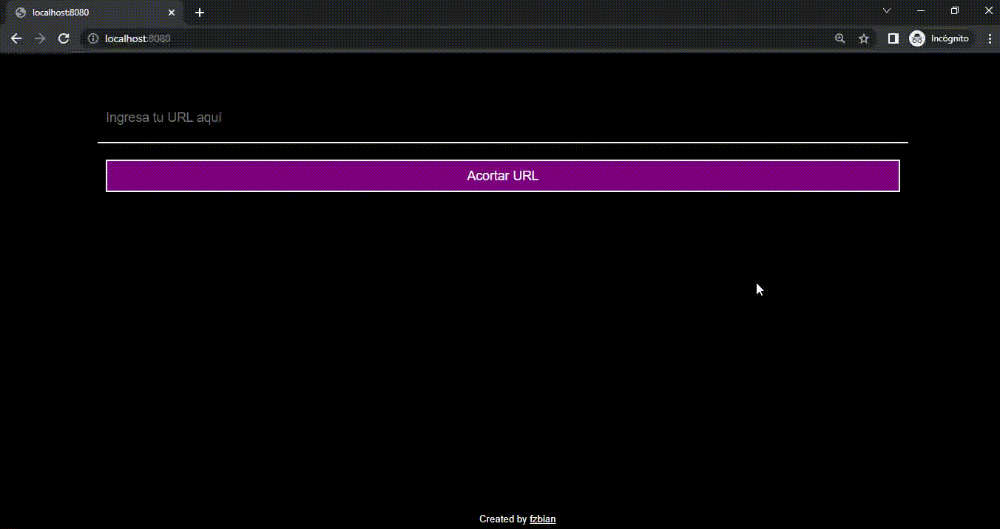

# URL Shortener

a simple url shortener created with go, mysql and html

## Screenshots



## API Reference

#### Create link

```http
  GET /addlink/?link=<url>
```

| Parameter | Type     | Description                |
| :-------- | :------- | :------------------------- |
| `url` | `string` | url to redirect |

#### Redirect

```http
  GET /<short>
```

| Parameter | Type     | Description                       |
| :-------- | :------- | :-------------------------------- |
| `short`      | `string` | the hash generated to redirect |

## Technologies

* echo (v4.9.0)
* mysql (MariaDB 10.4.27)
